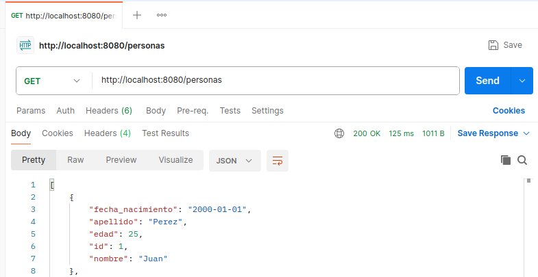
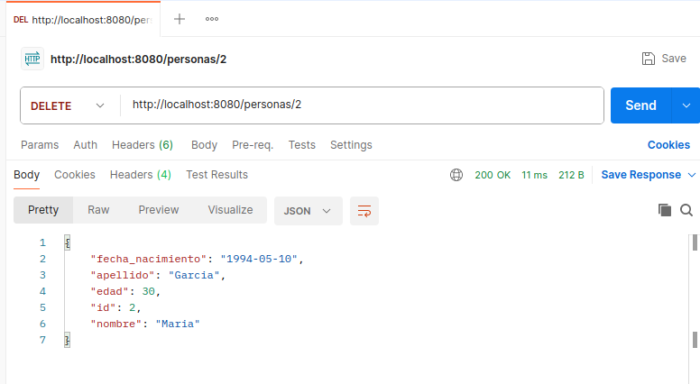
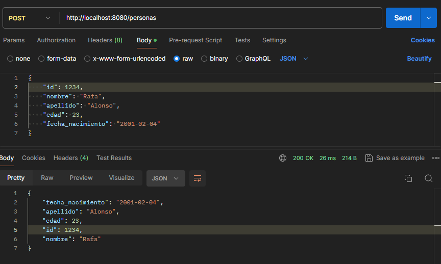
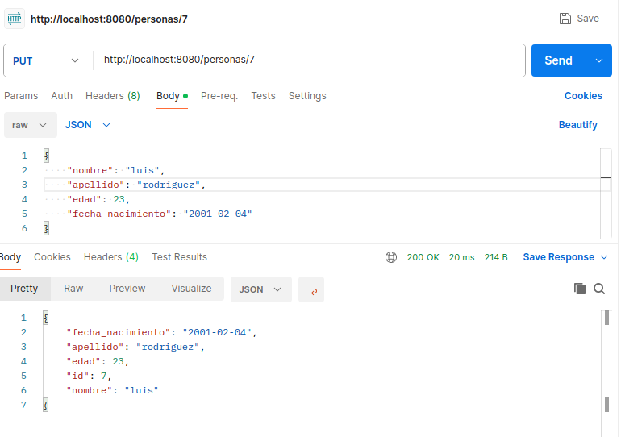

# Desarrollo de una Aplicación Web de To-Do List con Docker y FastApi

## Introducción

Este proyecto presenta una solución para el desarrollo de una aplicación web de lista de tareas (To-Do List) utilizando FastApi y Docker. Dado que el enunciado no era muy claro respecto al apartado de la lista de tareas, finalmente, la aplicación permite realizar operaciones básicas de creación, lectura, actualización y eliminación de usuarios de la tabla personas de nuestra base de datos. Se ha empleado un enfoque DevOps para el desarrollo y despliegue, utilizando herramientas como Docker para la contenerización de la aplicación y GitHub para el control de versiones y la colaboración.

Tanto la base de datos como el api de python han sido almacenados en contenedores que pueden comunicarse entre ellos. De este modo, el usuario puede realizar operaciones CRUD a través del api de una manera sencilla.

## Estructura del Proyecto

El proyecto está organizado de la siguiente manera:

```bash
proyecto-todo-list/
│
├── api/
│ ├── Dockerfile
│ ├── requirements.txt
│ └── app/
│   ├── <archivos del proyecto del API>
│   └── ...
│
└── docker/
├── sql/
│ └── script.sql
│
└── docker-compose.yml
```

- **api/**: Contiene los archivos necesarios para el desarrollo del API con FastApi.
  - **Dockerfile**: Archivo de configuración para generar la imagen del API en Python.
  - **requirements.txt**: Lista de dependencias del proyecto.
  - **app/**: Carpeta que contiene el proyecto del API.

- **docker/**: Contiene los archivos relacionados con Docker.
  - **sql/**: Carpeta que contiene el script SQL para la creación de tablas e inserción de datos iniciales.
  - **docker-compose.yml**: Archivo de configuración de Docker Compose para la gestión de contenedores.

## Pasos para ejecutar el proyecto: 

Para verificar que el proyecto funcionase correctamnte en otros dispositivos se ha procedido a levantarlo en una máquina virtual con los siguientes pasos:

### Ejecución del Proyecto

Para ejecutar correctamente el proyecto, sigue los siguientes pasos:

1. Abre una terminal.

2. Accede al directorio del proyecto donde se encuentra el archivo docker-compose:

    ```bash
    cd ~/soluciones/Docker
    ```


3. Ejecuta el comando `docker compose up -d` para levantar los contenedores en segundo plano:

    ```bash
    docker compose up -d
    ```

    Esto iniciará los contenedores definidos en el archivo `docker-compose.yml` en segundo plano (`-d`).

Al seguir estos pasos, los contenedores necesarios para ejecutar la aplicación se iniciarán correctamente.

## Tras esto, el api, ya conectado con la base de datos, será accesible a través de **http://localhost8080/personas**

Después de esto se ha procedido a realizar algunas pruebas con Postman: 






## Docker Compose en detalle

- **db**: Este servicio utiliza la imagen postgres:latest para ejecutar una instancia de PostgreSQL. Se etiqueta con información de los autores y la versión. La base de datos se inicializa con un nombre de base de datos (POSTGRES_DB), un nombre de usuario (POSTGRES_USER) y una contraseña (POSTGRES_PASSWORD). Además, se especifica el tamaño de la memoria compartida (shm_size) para evitar errores de PostgreSQL al crear extensiones.Los volúmenes se utilizan para persistir los datos de la base de datos. db_v:/var/lib/postgresql/data monta un volumen llamado db_v en el directorio donde PostgreSQL almacena sus datos. También se monta el script SQL init.sql en /docker-entrypoint-initdb.d/, lo que garantiza que se ejecute al iniciar el contenedor para inicializar la base de datos.

- **adminer**: Este servicio utiliza la imagen adminer para proporcionar una interfaz web para administrar la base de datos PostgreSQL. Se expone en el puerto 8082 del host.

- **api**: Este servicio utiliza la imagen ralonsostemdo/python-api:latest para ejecutar la aplicación FastApi. Se expone en el puerto 8080 del host. Se monta el directorio ../api/app en /app del contenedor para permitir el desarrollo y la actualización en caliente de la aplicación.


## Dockerfile de API en detalle

El Dockerfile define una imagen de contenedor para la aplicación FastAPI. Copia el archivo requirements.txt y las fuentes de la aplicación al contenedor, instala las dependencias, y luego inicia el servidor Uvicorn para servir la aplicación.

### [Link a la imagen que hemos subido a docker hub](https://hub.docker.com/repository/docker/ralonsostemdo/python-api/general)

## API en detalle

La estructura del api se ha realizado siguiendo el siguiente tutorial de la documentación oficial de FastApi:

### [FastAPI SQL (Relational) Databases](https://fastapi.tiangolo.com/tutorial/sql-databases/)

Se ha hecho uso de un **modelo** (**models.py**) para representar la unica tabla que hay en la base de datos, se utilizan diferentes **esquemas** (**schemas.py**) para manejar las estructuras del modelo. 

Además, los diferentes **endpoints** (que se encuentran en **main.py**) nos llevan a las funciones que se encargan de realizar los SELECT, INSERT UPDATE y DELETE (en **crud.py**)